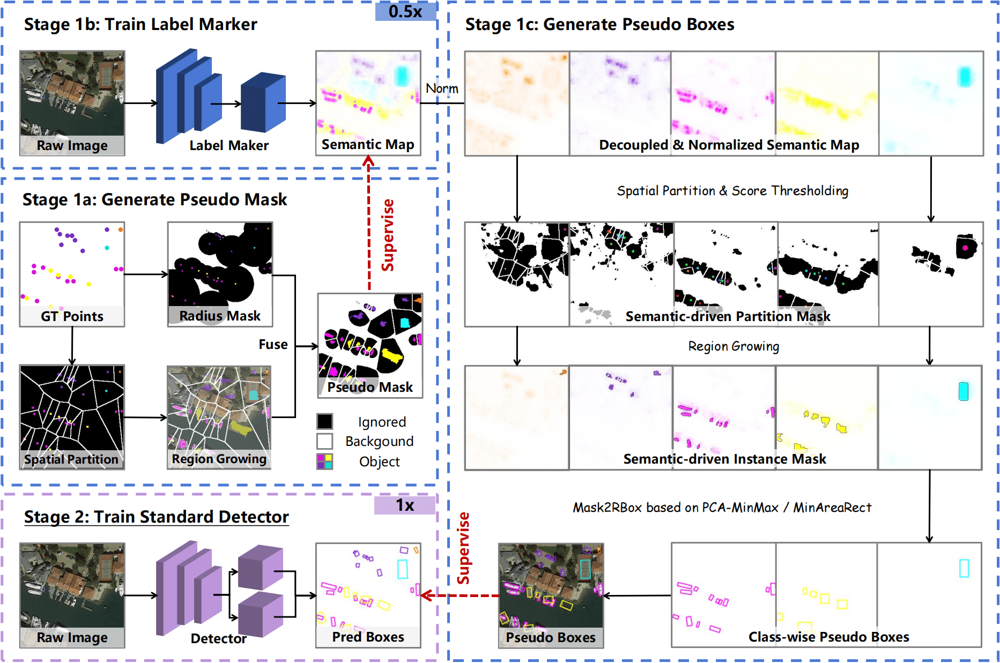

# Semantic-decoupled Spatial Partition Guided Point-supervised Oriented Object Detection

[](https://arxiv.org/pdf/2506.10601)
[](https://github.com/antxinyuan/ssp)
[](https://huggingface.co/antxinyuan/ssp)

🔥 We appreciate the attention to our paper. The code will be organized and released as soon as possible.

📢 The codes for training detectors by pseudo labels are released for the convenice of research, but codes for generating pseudo-labels will be released after the paper is officially accepted.

> Production from Institute of Computing Technology, Chinese Academy of Sciences.

> Primary contact: Xinyuan Liu ( liuxinyuan21s@ict.ac.cn ).

## TL;DR
This repository contains the source code of [**Semantic-decoupled Spatial Partition Guided Point-supervised Oriented Object Detection**](https://arxiv.org/pdf/2506.10601).

To tackle inadequate sample assignment and instance confusion in point-supervised oriented object detection for remote sensing dense scenes, we propose SSP (Semantic-decoupled Spatial Partition), a framework integrating rule-driven prior injection and data-driven label purification. Its core innovations include pixel-level spatial partition for sample assignment and semantic-modulated box extraction for pseudo-label generation. 



## Updates 
- [2025.6.17] The codes for training detectors by pseudo labels are released.
- [2025.6.13] TopoPoint paper is released at [arXiv](https://arxiv.org/abs/2506.10601).

### 🛠️ Installation

Please refer to the [Installation](https://github.com/open-mmlab/mmrotate/blob/main/README.md), we copy it here.

```
conda create -n open-mmlab python=3.7 pytorch==1.7.0 cudatoolkit=10.1 torchvision -c pytorch -y
conda activate open-mmlab
pip install openmim
mim install mmcv-full
mim install mmdet
git clone https://github.com/antxinyuan/ssp.git
cd mmrotate
pip install -r requirements/build.txt
pip install -v -e .
```

### 📊 Data Preparation

Please follow [data_preparation](tools/data) to prepare formatting data.

### Generate pseudo-labels
> 📢 The code and commands for generating pseudo-labels will be released after the paper is officially accepted. 

> 📢 Currently, pseudo-labels generated by our model are provided at [here](https://huggingface.co/antxinyuan/SSP/blob/main/pseudo_labels.zip), which can be used to understand the effect of our model and make comparisons in your research.

### 🏋️ Train & test Detector
The complete training & test command has been written into the [scripts](scripts). Please execute it directly.
```sehll
cd scripts
sh train_dota_rfcos.sh
```

### Pseudo-label performance
All pseudo-labeling results are available in [pseudo_labels](https://huggingface.co/antxinyuan/SSP/blob/main/pseudo_labels.zip).

| Dataset | mAP | mIoU | ann_file |
| :-: | :-: | :-: | :-: | 
| DOTA-v1.0 | 34.95 |49.03 | pseudo_labels/ssp_dotav10_hybrid/ |
| DOTA-v1.5 | 28.89 | 44.92 | pseudo_labels/ssp_dotav15_hybrid/ |
| DOTA-v2.0 | 24.72 | 41.93 | pseudo_labels/ssp_dotav20_hybrid/ |

### Detectors performance
| Dataset | Config | Log | Checkpoint | mAP(paper) | mAP(reproduced) |
| :-: | :-: | :-: | :-: | :-: | :-: |  
| SSP(RFOCS) | [config](configs/ssp/rfcos_ssp_dotav10.py) | [hugging face](https://huggingface.co/antxinyuan/SSP/blob/main/logs/rfcos_ssp_dotav10.json) |  [hugging face](https://huggingface.co/antxinyuan/SSP/blob/main/models/rfcos_ssp_dotav10-4c17ff33.pth) | 45.78 | 45.82 |
| SSP(ORCNN) | [config](configs/ssp/orcnn_ssp_dotav10.py) |  [hugging face](https://huggingface.co/antxinyuan/SSP/blob/main/logs/orcnn_ssp_dotav10.json) | [hugging face](https://huggingface.co/antxinyuan/SSP/blob/main/models/orcnn_ssp_dotav10-2df034d3.pth) | 47.86 | 48.81 |
| SSP(ReDet) | [config](configs/ssp/orcnn_ssp_dotav20.py) |  [hugging face](https://huggingface.co/antxinyuan/SSP/blob/main/logs/redet_ssp_dotav10.json) | [hugging face](https://huggingface.co/antxinyuan/SSP/blob/main/models/redet_ssp_dotav10-eed2738e.pth) | 48.50 | 49.02 |


## 🖊️ Citation

If you find this work helpful for your research, please consider giving this repo a star ⭐ and citing our papers:


## Citation
If this work is helpful for your research, please consider citing the following BibTeX entry.

``` bibtex
@misc{liu2025ssp,
      title={Semantic-decoupled Spatial Partition Guided Point-supervised Oriented Object Detection}, 
      author={Xinyuan Liu and Hang Xu and Yike Ma and Yucheng Zhang and Feng Dai},
      year={2025},
      eprint={2506.10601},
      archivePrefix={arXiv},
      primaryClass={cs.CV},
      url={https://arxiv.org/abs/2506.10601}, 
}

@inproceedings{xu2024acm,
  title={Rethinking boundary discontinuity problem for oriented object detection},
  author={Xu, Hang and Liu, Xinyuan and Xu, Haonan and Ma, Yike and Zhu, Zunjie and Yan, Chenggang and Dai, Feng},
  booktitle={Proceedings of the IEEE/CVF Conference on Computer Vision and Pattern Recognition},
  pages={17406--17415},
  year={2024}
}

```

## Related resources

We acknowledge all the open-source contributors for the following projects to make this work possible:
- [PointOBB-v2](https://github.com/VisionXLab/PointOBB-v2)
- [MMRotate](https://github.com/open-mmlab/mmrotate)
