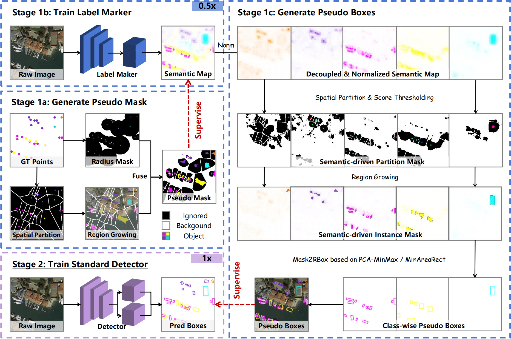

# Semantic-decoupled Spatial Partition Guided Point-supervised Oriented Object Detection [PR'26]

[](https://arxiv.org/pdf/2506.10601)
[](https://github.com/antxinyuan/ssp)
[](https://huggingface.co/antxinyuan/ssp)

🔥 We appreciate the attention to our paper. The codes have been organized and released!


> Production from Institute of Computing Technology, Chinese Academy of Sciences.

> Primary contact: Xinyuan Liu ( liuxinyuan21s@ict.ac.cn ).

## TL;DR
This repository contains the source code of [**Semantic-decoupled Spatial Partition Guided Point-supervised Oriented Object Detection**](https://arxiv.org/pdf/2506.10601).

To tackle inadequate sample assignment and instance confusion in point-supervised oriented object detection for remote sensing dense scenes, we propose SSP (Semantic-decoupled Spatial Partition), a framework integrating rule-driven prior injection and data-driven label purification. Its core innovations include pixel-level spatial partition for sample assignment and semantic-modulated box extraction for pseudo-label generation. 



## Updates 
- [2026.7.4] The codes for training labelmaker & generating pseudo-labels are released.
- [2026.5.23] The paper is accepted by Pattern Recognition 2026.
- [2025.6.17] The codes for training detectors by pseudo labels are released.
- [2025.6.13] TopoPoint paper is released at [arXiv](https://arxiv.org/abs/2506.10601).

### 🛠️ Installation

Please refer to the [Installation](https://github.com/open-mmlab/mmrotate/blob/main/README.md), we copy it here.

```
conda create -n open-mmlab python=3.8.0
conda activate open-mmlab
pip install torch==1.11.0+cu113 torchvision==0.12.0+cu113 torchaudio==0.11.0 --extra-index-url https://download.pytorch.org/whl/cu113
pip install openmim
mim install mmcv-full==1.7.0
mim install mmdet==2.28.2
git clone https://github.com/antxinyuan/ssp.git
cd mmrotate
pip install -r requirements/build.txt
pip install -v -e .
```

### 📊 Data Preparation

Please follow [data_preparation](tools/data) to prepare formatting data.

### 🏋️ Train Labelmaker & generate pseudo-labels
> 📢 Currently, pseudo-labels generated by our model are provided at [here](https://huggingface.co/antxinyuan/SSP/blob/main/pseudo_labels.zip), which can be used to understand the effect of our model and make comparisons in your research.

The complete training & generate command has been written into the [scripts](scripts). Please execute it directly.
```sehll
sh scripts/train_dota_labelmaker.sh
sh scripts/generate_dota_labelmaker.sh
```

### 🏋️ Train & test Detector
The complete training & test command has been written into the [scripts](scripts). Please execute it directly.
```sehll
cd scripts
sh train_dota_rfcos.sh
```

### Pseudo-label performance
All pseudo-labeling results are available in [here](https://huggingface.co/antxinyuan/SSP/blob/main/pseudo_labels.zip).

> *ssp_dotav10_hybrid_new* is trained & generated by this repo codes, but *ssp_dotav10_hybrid_old* is generated by original codes.
These two version of pseudo-labels are aviailable in [here](https://huggingface.co/antxinyuan/SSP/blob/main/ssp_dotav10_hybrid.zip).

| Dataset | mAP | mIoU | ann_file |
| :-: | :-: | :-: | :-: | 
| DOTA-v1.0 | 36.80 |49.51 | pseudo_labels/ssp_dotav10_hybrid_2xresolution/ |
| DOTA-v1.0 | 34.86 |48.55 | pseudo_labels/ssp_dotav10_hybrid_new/ |
| DOTA-v1.0 | 34.95 |49.03 | pseudo_labels/ssp_dotav10_hybrid_old/ |
| DOTA-v1.5 | 28.89 | 44.92 | pseudo_labels/ssp_dotav15_hybrid/ |
| DOTA-v2.0 | 24.72 | 41.93 | pseudo_labels/ssp_dotav20_hybrid/ |

### Detectors performance
> current results are trained with *ssp_dotav10_hybrid_2xresolution*.

| Model | Config | Log | Checkpoint | mAP |
| :-: | :-: | :-: | :-: | :-: | 
| SSP(RFOCS) | [config](configs/ssp/rfcos_ssp_dotav10.py) | [hugging face](https://huggingface.co/antxinyuan/SSP/blob/main/logs.zip) |  [hugging face](https://huggingface.co/antxinyuan/SSP/blob/main/models/rfcos_ssp_dotav10-ec0cd9cd.pth) | 48.41 |
| SSP(ORCNN) | [config](configs/ssp/orcnn_ssp_dotav10.py) |  [hugging face](https://huggingface.co/antxinyuan/SSP/blob/main/logs.zip) | [hugging face](https://huggingface.co/antxinyuan/SSP/blob/main/models/orcnn_ssp_dotav10-e4379e23.pth) | 50.00 | 
| SSP(ReDet) | [config](configs/ssp/orcnn_ssp_dotav20.py) |  [hugging face](https://huggingface.co/antxinyuan/SSP/blob/main/logs.zip) | [hugging face](https://huggingface.co/antxinyuan/SSP/blob/main/models/redet_ssp_dotav10-a2e22558.pth) | 50.81 |


## 🖊️ Citation

If you find this work helpful for your research, please consider giving this repo a star ⭐ and citing our papers:


## Citation
If this work is helpful for your research, please consider citing the following BibTeX entry.

``` bibtex
@article{liu2026ssp,
  title = {Semantic-decoupled spatial partition guided point-supervised oriented object detection},
  journal = {Pattern Recognition},
  pages = {114079},
  year = {2026},
  issn = {0031-3203},
  doi = {https://doi.org/10.1016/j.patcog.2026.114079},
  url = {https://www.sciencedirect.com/science/article/pii/S0031320326010447},
  author = {Xinyuan Liu and Hang Xu and Zirui Chen and Yike Ma and Chenggang Yan and Feng Dai},
  keywords = {Object detection, Weakly-supervised learning},
}

@inproceedings{xu2024acm,
  title={Rethinking boundary discontinuity problem for oriented object detection},
  author={Xu, Hang and Liu, Xinyuan and Xu, Haonan and Ma, Yike and Zhu, Zunjie and Yan, Chenggang and Dai, Feng},
  booktitle={Proceedings of the IEEE/CVF Conference on Computer Vision and Pattern Recognition},
  pages={17406--17415},
  year={2024}
}

```

## Related resources

We acknowledge all the open-source contributors for the following projects to make this work possible:
- [PointOBB-v2](https://github.com/VisionXLab/PointOBB-v2)
- [MMRotate](https://github.com/open-mmlab/mmrotate)
